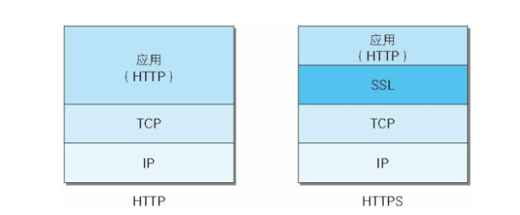
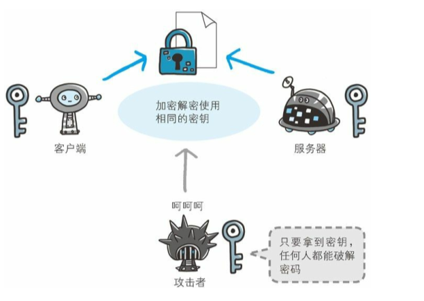
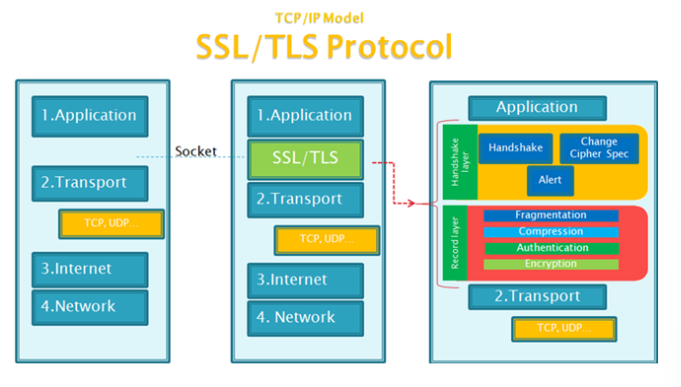
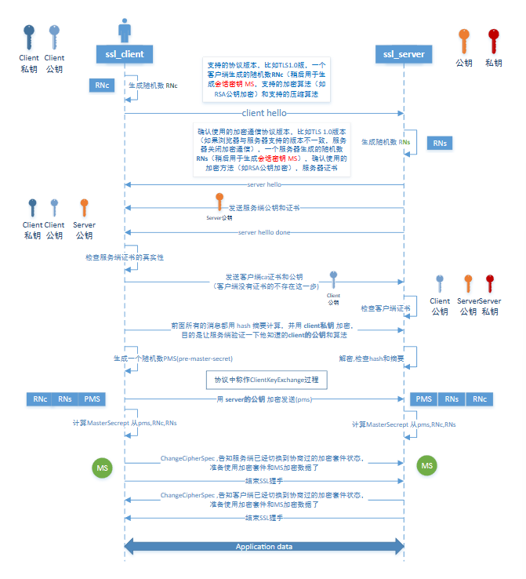
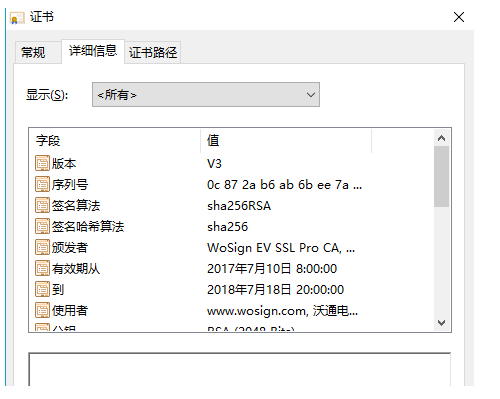
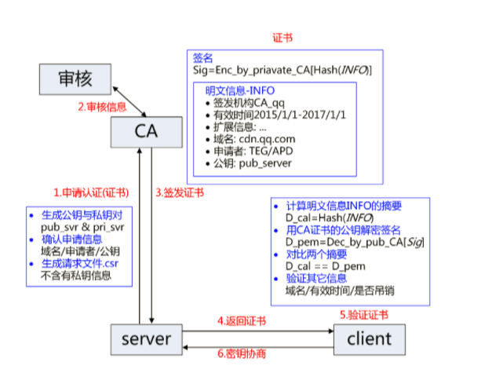

# 1. http通信有什么问题
- 窃听 - 对称加密
- 传递密钥 - 非对称加密
- 安全速度 - 非对称加密+对称加密
- 中间人攻击 - 证书
- 证书伪造 - 消息摘要
- 摘要伪造 - 数字签名
## 1.1 可能被窃听
- HTTP 本身不具备加密的功能,HTTP 报文使用明文方式发送
- 由于互联网是由联通世界各个地方的网络设施组成,所有发送和接收经过某些设备的数据都可能被截获或窥视。(例如大家都熟悉的抓包工具:Wireshark),即使经过加密处理,也会被窥视是通信内容,只是可能很难或者无法破解出报文的信息而已
## 1.2 认证问题
- 无法确认你发送到的服务器就是真正的目标服务器(可能服务器是伪装的)
- 无法确定返回的客户端是否是按照真实意图接收的客户端(可能是伪装的客户端)
- 无法确定正在通信的对方是否具备访问权限,Web 服务器上某些重要的信息，只想发给特定用户即使是无意义的请求也会照单全收。无法阻止海量请求下的 DoS 攻击（Denial of Service，拒绝服务攻击）。
## 1.3 可能被篡改
请求或响应在传输途中，遭攻击者拦截并篡改内容的攻击被称为中间人攻击（Man-in-the-Middle attack，MITM）。
# 2. HTTPS如何解决上述三个问题
HTTPS是在通信接口部分用 TLS(Transport Layer Security)协议

# 3. SSL 和 TLS 的区别
- 传输层安全性协议（英语：Transport Layer Security，缩写作 TLS），及其前身安全套接层（Secure Sockets Layer，缩写作 SSL）是一种安全协议，目的是为互联网通信，提供安全及数据完整性保障。
- 网景公司（Netscape）在1994年推出首版网页浏览器，网景导航者时，推出HTTPS协议，以SSL进行加密，这是SSL的起源。
- IETF将SSL进行标准化，1999年公布第一版TLS标准文件。随后又公布RFC 5246 （2008年8月）与 RFC 6176 （2011年3月）。以下就简称SSL
- TLS是SSL的标准. HTTPS 就是 HTTP + SSL
  
## 3.1 SSL协议
HTTPS 协议的主要功能基本都依赖于 TLS/SSL 协议，TLS/SSL 的功能实现主要依赖于三类基本算法：散列函数 、对称加密和非对称加密，其利用非对称加密实现身份认证和密钥协商，对称加密算法采用协商的密钥对数据加密，基于散列函数验证信息的完整性。

### 3.1.1 对称加密
- 常见的有 AES-CBC、DES、3DES、AES-GCM等，相同的密钥可以用于信息的加密和解密，掌握密钥才能获取信息，能够防止信息窃听，通信方式是1对1；
- 对称加密需要共享相同的密码，密码的安全是保证信息安全的基础，服务器和多 个客户端通信，需要维持多个密码记录，且缺少修改密码的机制；
- 优点：算法公开、计算量小、加密速度快、加密效率高。
- 缺点：交易双方都使用同样钥匙，安全性得不到保证。

### 3.1.2 非对称加密技术
- 即常见的 RSA 算法，还包括 ECC、DH 等算法，算法特点是，密钥成对出现，一般称为公钥(公开)和私钥(保密)，公钥加密的信息只能私钥解开，私钥加密的信息只能公钥解开。因此掌握公钥的不同客户端之间不能互相解密信息，只能和掌握私钥的服务器进行加密通信，服务器可以实现1对多的通信，客户端也可以用来验证掌握私钥的服务器身份。
- 非对称加密的特点是信息传输一对多，服务器只需要维持一个私钥就能够和多个客户端进行加密通信，但服务器发出的信息能够被所有的客户端解密，且该算法的计算复杂，加密速度慢。
- 
### 3.1.3 完整性验证算法
- 常见的有 MD5、SHA1、SHA256，该类函数特点是函数单向不可逆、对输入非常敏感、输出长度固定，针对数据的任何修改都会改变散列函数的结果，用于防止信息篡改并验证数据的完整性；
- 在信息传输过程中，散列函数不能单独实现信息防篡改，因为明文传输，中间人可以修改信息之后重新计算信息摘要，因此需要对传输的信息以及信息摘要进行加密
### 3.1.4 工作方式
结合三类算法的特点，TLS 的基本工作方式是

- 客户端使用非对称加密与服务器进行通信，实现身份验证并协商对称加密使用的密钥
- 然后对称加密算法采用协商密钥对信息以及信息摘要进行加密通信，不同的节点之间采用的对称密钥不同，从而可以保证信息只能通信双方获取。
### 3.1.5 SSL协议构成
- 第一层是记录协议(Record Protocol), 用于定义传输格式。
- 第二层握手协议(Handshake Protocol),它建立在SSL记录协议之上,用于在实际的数据传输开始前，通讯双方进行身份认证、协商加密算法、交换加密密钥等

## 3.2 HTTPS协议改进过程
### 3.2.1 针对窃听风险
黑客可以嗅探通信内容

对称加密算法的特点是加密和解密是使用同一个密钥，加解密速度快，典型的对称加密算法有DES、AES等。使用对称加密，客户端和服务端双方拥有相同的密钥，信息得到安全传输。 此种方式的缺点是：

- 客户端、服务器双方都需要维护大量的密钥，维护成本很高；
- 因每个客户端、服务器的安全级别不同，密钥容易泄露；
## 3.3 安全传递密钥
非对称加密算法的特点加密和解密分别使用不同的密钥, 相对来说加解密速度较慢，典型的非对称加密算法有RSA、DSA等。客户端用公钥对请求内容加密，服务器使用私钥对内容解密，反之亦然。 此种方式的缺点是：

- 公钥是公开的，所以针对私钥加密的信息，黑客截获后可以使用公钥进行解密，获取其中的内容；
- 公钥并不包含服务器的信息，使用非对称加密算法无法确保服务器身份的合法性，存在中间人攻击的风险，服务器发送给客户端的公钥可能在传送过程中被中间人截获并篡改；
- 使用非对称加密在数据加密解密过程需要消耗一定时间，降低了数据传输效率；

客户端C和服务器S进行通信，中间节点M截获了二者的通信； 节点M自己计算产生一对公钥pub_M和私钥 pri_M； C向S请求公钥时，M把自己的公钥pub_M发给了C； C 使用公钥pub_M加密的数据能够被M解密，因为M掌握对应的私钥 pri_M，而 C 无法根据公钥信息判断服务器的身份，从而 C 和 M 之间建立了“可信”加密连接; 中间节点 M 和服务器S之间再建立合法的连接，因此 C 和 S 之间通信被M完全掌握，M 可以进行信息的窃听、篡改等操作。
### 3.3.1 SSL密钥协商的过程如下

#### 3.3.1.1 client_hello过程
客户端发起请求，以明文传输请求信息，包含版本信息，加密套件候选列表，压缩算法候选列表，随机数，扩展字段等信息，相关信息如下：

- 版本信息: 支持的最高TSL协议版本version，从低到高依次 SSLv2 SSLv3 TLSv1 TLSv1.1 TLSv1.2，当前基本不再使用低于 TLSv1 的版本
- 加密套件候选列表(cipher suite): 认证算法 Au (身份验证)、密钥交换算法 KeyExchange(密钥协商)、对称加密算法 Enc (信息加密)和信息摘要 Mac(完整性校验);
- 压缩算法候选列表:支持的压缩算法 compression methods 列表，用于后续的信息压缩传输;
- 随机数:随机数就是上图里的RNc,用于后续生成协商密钥;
- 协商数据:支持协议与算法的相关参数以及其它辅助信息等，常见的 SNI 就属于扩展字段，后续单独讨论该字段作用。
#### 3.3.1.1 server_hello 过程
- 服务端返回协商的信息结果，包括选择使用的协议版本version，选择的加密套件 cipher suite，选择的压缩算法 compression method、随机数 RNs等，其中随机数用于后续的密钥协商;
- 服务器证书链,用于身份校验和密钥交换
- 通知客户端server-hello结束,请求客户端的证书和密钥
#### 3.3.1.1 证书校验，协商最后通信密钥
a. 客户端验证服务端证书的合法性，如果验证通过才会进行后续通信，否则根据错误情况不同做出提示和操作，合法性验证包括如下：

- 证书链的可信性 trusted certificate path
- 证书是否吊销 revocation
- 有效期 expiry date，证书是否在有效时间范围;
- 域名 domain，核查证书域名是否与当前的访问域名匹配，匹配规则后续分析; b. 客户端发送客户端证书,公钥服务端验证(过程同客户端验证) c. 客户端hash所有之前的消息,发送hash值和摘要,用客户端的私钥加密发送给服务端,服务端用客户端的公钥解密,验证了服务端获取的客户端的公钥和算法是正确的 d. 客户端生成pms,用服务端的公钥加密后发送给服务端 e. 客户端和服务端同时计算出最终会话密钥(MS)
#### 3.3.1.1 验证协商密钥
a. Client发送ChangeCipherSpec，指示Server从现在开始发送的消息都是加密过的 b. Client发送Finishd，包含了前面所有握手消息的hash，可以让server验证握手过程是否被第三方篡改 c. 服务端发送ChangeCipherSpec，指示Client从现在开始发送的消息都是加密过的 d. Server发送Finishd，包含了前面所有握手消息的hash，可以让client验证握手过程是否被第三方篡改，并且证明自己是Certificate密钥的拥有者，即证明自己的身份
#### 3.3.1.1 HTTPS完整建立连接过程,如下图
- 首先建立tcp握手连接
- 进行ssl协议的握手密钥交换(Handshake protocal)
- 然后通过共同约定的密钥开始通信

## 3.4 证书
证书的作用就是,我和服务端通信,我怎么知道这个服务端是我要真正通信的服务端呢

### 3.4.1 申请和发放证书流程如下

- 服务方 Server 向第三方机构CA提交公钥、组织信息、个人信息(域名)等信息并申请认证;
- CA通过线上、线下等多种手段验证申请者提供信息的真实性，如组织是否存在、企业是否合法，是否拥有域名的所有权等;
- 如信息审核通过，CA会向申请者签发认证文件-证书。证书包含以下信息：申请者公钥、申请者的组织信息和个人信息、签发机构 CA的信息、有效时间、证书序列号等信息的明文，同时包含一个签名; 签名的产生算法：首先，使用散列函数计算公开的明文信息的信息摘要，然后，采用 CA的私钥对信息摘要进行加密，密文即签名;
- 客户端 Client 向服务器 Server 发出请求时，Server 返回证书文件;
- 客户端 Client 读取证书中的相关的明文信息，采用相同的散列函数计算得到信息摘要，然后，利用对应 CA的公钥解密签名数据，对比证书的信息摘要，如果一致，则可以确认证书的合法性，即公钥合法;
- 客户端还会验证证书相关的域名信息、有效时间等信息; 客户端会内置信任CA的证书信息(包含公钥)，如果CA不被信任，则找不到对应 CA的证书，证书也会被判定非法。
### 3.4.2 证书链

- 服务器证书 server.pem 的签发者为中间证书机构 inter，inter 根据证书 inter.pem 验证 server.pem 确实为自己签发的有效证书
- 中间证书 inter.pem 的签发 CA 为 root，root 根据证书 root.pem 验证 inter.pem 为自己签发的合法证书;
- 客户端内置信任 CA 的 root.pem 证书，因此服务器证书 server.pem 的被信任。
- 服务器证书、中间证书与根证书在一起组合成一条合法的证书链，证书链的验证是自下而上的信任传递的过程。
## 3.5 https服务器
- HTTPS使用https协议，默认端口号443；
- HTTPS需要向证书授证中心申请证书；
- HTTPS服务器与客户端之间传输是经过SSL安全加密后的密文数据； 在创建HTTPS服务器之前，服务器首先需要创建公钥、私钥及证书，步骤如下 创建公钥、私钥及证书
### 3.5.1 创建私钥
    openssl genrsa -out privatekey.pem 1024
### 3.5.2 创建证书签名请求
    openssl req -new -key privatekey.pem -out certrequest.csr
### 3.5.3 获取证书，线上证书需要经过证书授证中心签名的文件；下面只创建一个学习使用证书
    openssl x509 -req -in certrequest.csr -signkey privatekey.pem -out certificate.pem
### 3.5.4 创建pfx文件
    openssl pkcs12 -export -in certificate.pem -inkey privatekey.pem -out certificate.pfx
### 3.5.5 创建服务器
创建HTTPS服务器同HTTP服务器大致相同，需要增加证书，创建HTTPS服务器时通过options参数设置。

    https.createServer(options,[requestListener]);
- pfx 私钥、公钥以及证书
- key 私钥
- passphrase 为私钥指定密码
- cert 公钥
- ca 证书，用于指定一组证书，默认属性值为几个著名的证书授权中心,例如VerlSign
- crl 指定证书吊销主
#####
    import https from 'https';
    import fs from 'fs';

    var pk = fs.readFileSync('privatekey.pem'),
        pc = fs.readFileSync('certificate.pem');

    var opts = {
        key: pk,
        cert: pc
    };

    var server = https.createServer(opts);
opts参数为一个对象，用于指定创建HTTPS服务器时配置的各种选项，下面只描述几个必要选项：

|属性名|	说明|
|------|:-------:|
|pff|	用于指定从pfx文件读取出的私钥、公钥以及证书（指定该属性后，无需再指定key、cert、ca）|
|key	|用于指定后缀名为pem的文件，读出私钥|
|cert|	用于指定后缀名为pem的文件，读出公钥|
|ca	|用于指定一组证书，默认值为几个著名的证书授证中心|
### 3.5.6 创建HTTPS客户端
在https模块中，可以使用request方法向其它使用HTTPS协议的网站请求数据
    let req = https.request(options,callback);
- host 指定域名或目标主机的IP地址
- hostname 指定域名或目标主机的IP地址
- port 端口号
- method 指定请求方法名
- path 指下请求路径及查询字符串
- headers 客户端请求头对象
- auth 指定认证信息部分
- agent 指定用户代理,指定false则从连接池中挑选一个连接状态为关闭的https.Agent对象
- pfx 指定私钥、公钥和证书
- key 指定私钥
- cert 公钥
- ca 一组证书
#####
    const options = {
            hostname: 'localhost',
            port: 1443,
            path: '/',
            method: 'post',
            key: fs.readFileSync('privatekey.pem'),
            cert: fs.readFileSync('certificate.pem'),
            rejectUnhauthorized: false,
            agent: false // 从连接池中指定挑选一个当前连接状态为关闭的https.Agent
        },
        req = https.request(options);

    // 或者
    const options = {
            hostname: 'localhost',
            port: 1443,
            path: '/',
            method: 'post',
            key: fs.readFileSync('privatekey.pem'),
            cert: fs.readFileSync('certificate.pem'),
            rejectUnhauthorized: false,
        };
    // 显示指定https.Agent对象
    options.agent = new https.Agent(options);
    var req = https.request(options);
## 3.6 让你的网站支持https
实战申请Let's Encrypt永久免费SSL证书过程教程及常见问题
    git clone https://github.com/letsencrypt/letsencrypt
    cd letsencrypt
    chmod 777 ./letsencrypt-auto
    ./letsencrypt-auto certonly --standalone --email zhang_renyang@126.com -d itnewhand.com

    /etc/letsencrypt/live/itnewhand.com/fullchain.pem
    /etc/letsencrypt/live/itnewhand.com/privkey.pem
#### 生成证书时要先停掉nginx

